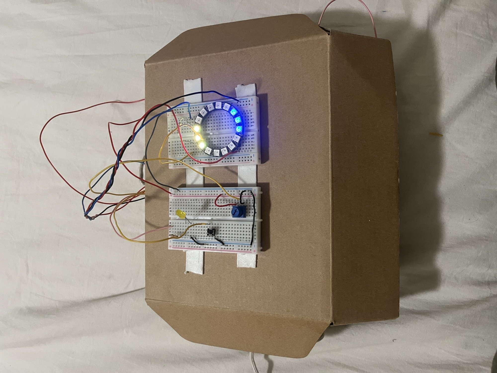

# Embedded-Tilt-LED-Ring-Audio-System

STM32 embedded system integrating WS2812 LED control, BMI160 accelerometer sensing, SAI/I²S audio playback, DMA-based ADC sampling, PWM control, timer interrupts, and UART debugging.



---

## Overview

This project expands the original tilt-controlled WS2812 LED ring system from Project 1 into a more advanced embedded system integrating real-time digital audio playback, DMA-driven peripherals, interrupt-driven processing, and multi-peripheral operation on the STM32L432KC microcontroller.

The final system combines:

- WS2812B LED ring control
- BMI160 accelerometer tilt sensing
- SAI/I²S audio output
- MAX98357A digital audio amplifier
- DMA-based ADC sampling
- PWM brightness control
- TIM6 interrupt-driven averaging
- UART debugging and monitoring

The system detects tilt direction using the BMI160 accelerometer and displays the direction on the LED ring using a 3-LED pointer. When excessive tilt is detected, a 300 Hz warning tone is played through the speaker using SAI/I²S and DMA audio streaming.

The project demonstrates embedded systems integration using multiple peripherals operating simultaneously in real time.

---

## Objectives

The objectives of this project were:

- Restore and extend the original Project 1 tilt-controlled LED system
- Implement SAI/I²S digital audio output
- Configure DMA-based audio streaming
- Generate and playback waveform lookup tables
- Implement continuous ADC sampling using DMA
- Introduce interrupt-driven system behaviour
- Integrate audio response with accelerometer tilt direction
- Maintain stable operation while multiple peripherals operate simultaneously
- Apply structured debugging and testing methods
- Develop the project incrementally using GitHub version control

---

## Final System Features

The final integrated system includes:

- Tilt-controlled WS2812B LED ring
- 3-LED directional pointer
- Low-pass filtered accelerometer readings
- Dead-zone stability region
- Push-button colour selection
- Saved-position mode using potentiometer input
- PWM brightness control
- DMA-based ADC sampling
- SAI/I²S digital audio playback
- MAX98357A audio amplifier output
- Tilt-triggered 300 Hz warning tone
- UART debugging output
- TIM6 interrupt-driven ADC averaging

---

## Hardware Used

- STM32L432KC Nucleo board
- BMI160 accelerometer
- WS2812B 16-LED ring
- MAX98357A I²S mono amplifier
- 8 Ω speaker
- Potentiometer
- Push button
- 330 Ω resistor (WS2812 data line protection)
- Breadboard and jumper wires
- Oscilloscope for waveform debugging

---

## Peripheral Usage

| Peripheral | Purpose |
|---|---|
| GPIO | WS2812 output, button input, debug outputs |
| I2C | BMI160 accelerometer communication |
| ADC1 | Potentiometer analogue input |
| DMA1 Channel 1 | Continuous ADC sampling |
| DMA2 Channel 6 | SAI audio transfer |
| SAI1 | I²S digital audio transmission |
| TIM2 | PWM output on PA3 |
| TIM6 | Periodic interrupt for ADC averaging |
| UART (USART2) | Serial debugging output |
| DWT Cycle Counter | Precise WS2812 timing generation |

---

## System Wiring

### WS2812 LED Ring

| LED Ring | STM32 |
|---|---|
| DIN | PA7 (via 330 Ω resistor) |
| VCC | 5 V |
| GND | GND |

### BMI160 Accelerometer

| BMI160 | STM32 |
|---|---|
| SDA | I2C SDA |
| SCL | I2C SCL |
| VCC | 3.3 V |
| GND | GND |

### MAX98357A I²S Amplifier

| MAX98357A | STM32 |
|---|---|
| BCLK | PA8 |
| LRC | PA9 |
| DIN | PA10 |
| VIN | 5 V |
| GND | GND |
| SD | 5 V |

### Potentiometer

| Potentiometer Pin | Connection |
|---|---|
| Side 1 | 3.3 V |
| Side 2 | GND |
| Middle | PA0 |

### Push Button

| Button | STM32 |
|---|---|
| Input | PB3 |

---

## Software Architecture

The project software was developed incrementally across multiple stages.

The final software structure contains:

- WS2812 driver functions
- SAI/I²S audio driver functions
- DMA configuration
- ADC sampling subsystem
- TIM6 interrupt subsystem
- Accelerometer processing
- Audio tone control
- UART debugging system
- LED pointer mapping
- PWM brightness control

A low-level register-based programming approach was used throughout the project to provide precise hardware control and deeper understanding of peripheral operation.

---

## Task 1 — Re-establishing the Project 1 System

### Goal

Restore the fully working tilt-controlled LED ring system from Project 1.

### Functionality Restored

- WS2812 LED ring control
- BMI160 accelerometer communication
- Direction mapping
- 3-LED tilt pointer
- Low-pass filtering
- Potentiometer input
- PWM brightness control
- Saved-position feature
- UART debug output

### Result

The original Project 1 system was successfully restored and verified.

The system demonstrated:

- stable LED output
- smooth tilt tracking
- reliable I²C communication
- accurate direction mapping
- correct PWM operation
- stable filtered accelerometer readings

This stage provided the working baseline used for all later project integration.

---

## Task 2 — Configuring the SAI / I²S Speaker Output

### Goal

Configure the STM32L432 SAI peripheral for digital audio transmission to the MAX98357A I²S amplifier.

### Implementation

The following pins were configured for SAI alternate functions:

| Pin | Function |
|---|---|
| PA8 | BCLK |
| PA9 | LRC |
| PA10 | DIN |

PLLSAI1 was configured to generate the audio clock, while SAI1 Block A was configured as:

- master transmitter
- 16-bit audio
- stereo frame format
- DMA-enabled operation

DMA2 Channel 6 transferred audio samples directly from memory to the SAI data register.

### Result

Digital audio output was successfully transmitted to the MAX98357A amplifier using SAI and DMA.

The CPU was not required to manually transmit samples during playback, confirming successful background DMA operation.

---

## Task 3 — Audio Playback Verification

### Goal

Verify successful audio playback through the MAX98357A speaker system.

### Implementation

Audio sample arrays stored in memory were streamed continuously to the SAI peripheral using DMA circular mode.

Different waveform buffers were tested, including:

- generated tone data
- sine wave lookup tables generated in MATLAB
- multiple frequency waveforms

PB3 was used as a heartbeat GPIO output during testing to confirm that the CPU continued executing while DMA handled audio streaming independently.

### Result

Audio playback was successfully produced through the speaker.

Testing verified:

- correct SAI configuration
- successful DMA audio transfer
- valid I²S communication
- correct audio clock generation
- successful amplifier operation

Testing also showed that incorrect sample formatting or DMA lengths could produce distorted output, highlighting the importance of correct I²S frame formatting.

---

## Task 4 — Timer-Based System Control

### Goal

Introduce interrupt-driven system timing using a hardware timer.

### Implementation

TIM6 was configured to generate periodic interrupts. TIM2 remained dedicated to PWM generation only.

The interrupt routine:

- averaged the DMA ADC buffer
- updated `adc_average`
- set a software flag for the main loop

The interrupt handler used in the final system was:

```c
void TIM6_DAC_IRQHandler(void)
{
    if (TIM6->SR & (1 << 0))
    {
        TIM6->SR &= ~(1 << 0);

        uint32_t sum = 0;

        for (int i = 0; i < ADC_BUF_SIZE; i++)
        {
            sum += adc_buffer[i];
        }

        adc_average = sum / ADC_BUF_SIZE;

        timer_flag = 1;
    }
}
```

### Result

Interrupt-driven timing was successfully implemented using TIM6.

The processor no longer relied entirely on polling loops for periodic operations.

ADC averaging operated independently in the background while:

- audio playback continued
- LED updates continued
- UART debugging continued
- accelerometer processing continued

This demonstrated successful interrupt-based multitasking behaviour.

---

## Task 5 — DMA-Based ADC Sampling

### Goal

Implement continuous ADC sampling using DMA and analogue potentiometer input.

### Implementation

A potentiometer connected to PA0 was sampled continuously using ADC1.

DMA1 Channel 1 transferred ADC samples into a circular memory buffer:

```c
volatile uint16_t adc_buffer[ADC_BUF_SIZE];
```

Continuous conversion mode and DMA circular mode were enabled.

TIM6 interrupts periodically averaged the buffer contents and updated `adc_average`.

### Result

The ADC continuously sampled the potentiometer without CPU polling.

The potentiometer smoothly adjusted the ADC reading from approximately 0 to 4095.

DMA-based sampling significantly reduced CPU overhead while improving responsiveness.

UART output confirmed stable averaged ADC readings during operation.

---

## Task 6 — Audio Response Based on Tilt Direction

### Goal

Use accelerometer tilt direction to control audio playback behaviour.

### Implementation

The system monitored filtered accelerometer values and activated a warning tone whenever excessive tilt was detected:

```c
static void update_audio_warning(void)
{
    if (X_filt > AUDIO_LIMIT ||
        X_filt < -AUDIO_LIMIT ||
        Y_filt > AUDIO_LIMIT ||
        Y_filt < -AUDIO_LIMIT)
    {
        set_audio_tone(audio_data);
    }
    else
    {
        set_audio_tone(tone_silent);
    }
}
```

The warning tone activated whenever excessive tilt exceeded:

```c
#define AUDIO_LIMIT 750
```

DMA audio playback continued continuously while the active audio buffer was switched dynamically using `set_audio_tone()`.

### Result

The speaker successfully produced a 300 Hz warning tone whenever excessive tilt was detected in the X or Y axis.

The speaker muted automatically when tilt returned within the safe operating region.

This confirmed successful integration of:

- I²C accelerometer sensing
- DMA audio streaming
- SAI/I²S transmission
- real-time audio control

---

## Task 7 — Final Integration and Optimisation

### Goal

Integrate all subsystems into one stable real-time embedded system.

### Integrated Features

The final system combined:

- WS2812 LED ring
- BMI160 accelerometer
- SAI/I²S audio
- DMA ADC sampling
- TIM6 interrupt processing
- TIM2 PWM output
- UART debugging
- button input
- saved-position mode

### Result

The final integrated system successfully retained all original Project 1 functionality while adding a tilt-triggered audio warning feature.

The WS2812 LED ring continued to display the live tilt direction using a 3-LED pointer, colour selection through the push button remained operational, PWM brightness control from the potentiometer functioned correctly, and saved-position mode still operated as intended.

A 300 Hz warning tone was produced through the MAX98357A speaker whenever excessive tilt was detected in the X or Y direction. The tone activated once the filtered accelerometer values exceeded the defined AUDIO_LIMIT threshold of 750.

Audio generation used the SAI peripheral configured in I²S mode, with DMA2 Channel 6 continuously transferring samples from the `audio_data` waveform table to the SAI data register in circular mode. The `tone_silent` buffer was played during normal operation, muting the speaker when tilt was within the safe range.

ADC sampling was performed continuously using DMA1 Channel 1 in circular mode, filling a 32-sample buffer from the potentiometer on PA0. TIM6 generated a periodic interrupt using `TIM6_DAC_IRQHandler` which averaged the ADC buffer and set a flag for the main loop to print the current ADC value over UART.

The button was relocated to PB3 to avoid conflicts with the SAI audio pins on PA8, PA9 and PA10.

All embedded subsystems operated simultaneously without timing conflicts:

- I²C accelerometer
- WS2812 LED ring
- SAI/I²S audio
- DMA ADC sampling
- TIM2 PWM
- TIM6 interrupt processing
- UART debugging

The final system remained stable, responsive, and fully functional during continuous operation.

---

## WS2812 Timing and DWT Cycle Counter

The WS2812B LED protocol requires highly accurate timing.

Direct GPIO control together with the DWT cycle counter was used to generate the required waveform timing.

At 80 MHz, 1 cycle = 12.5 ns.

| Bit Type | High Time | Low Time |
|---|---|---|
| Logic 0 | ~0.4 µs | ~0.85 µs |
| Logic 1 | ~0.8 µs | ~0.45 µs |

The DWT cycle counter provided accurate microsecond timing without relying on software delay loops.

---

## Testing and Debugging

### Software Debugging

- UART serial output
- ADC value monitoring
- accelerometer value printing
- DMA verification
- timer flag monitoring

### Hardware Debugging

- oscilloscope verification of WS2812 waveform
- verification of I²S clock signals
- confirmation of SAI audio output

### Incremental Testing

Each subsystem was verified independently before full integration:

| Test | Verification |
|---|---|
| WS2812 test | Correct LED timing |
| I²C test | Valid BMI160 communication |
| SAI test | Correct audio output |
| DMA ADC test | Continuous ADC sampling |
| TIM6 test | Interrupt operation |
| PWM test | Brightness control |
| Integration test | Simultaneous subsystem operation |

---

## Circuit Schematic

A full schematic was created using KiCad.

The schematic includes:

- STM32L432 connections
- WS2812 LED ring
- BMI160 accelerometer
- MAX98357A amplifier
- potentiometer
- push button
- PWM output
- power connections

[View Full Schematic PDF](Circuit_schematic.pdf)

---

## Development Log

A detailed development and testing log is included in the repository.

The test log documents:

- code development stages
- debugging procedures
- subsystem testing
- DMA verification
- interrupt testing
- waveform testing
- integration results

[View Full Development Log](test_log.pdf)

---

## GitHub and Version Control

GitHub was used throughout development for:

- source code management
- documentation
- version tracking
- incremental development
- testing evidence

The repository documents the evolution of the project from the original Project 1 system into the final integrated embedded system.

---

## Ethical Considerations

This project demonstrates embedded systems concepts commonly used in:

- industrial monitoring
- alarm systems
- safety systems
- real-time control systems

Reliable testing and debugging are critical in embedded systems because failures in timing, interrupts, DMA configuration, or peripheral communication can produce unsafe system behaviour.

The project also demonstrates the importance of structured testing and incremental integration when developing complex real-time systems.

---

## Results Summary

The final system successfully demonstrated:

- real-time tilt detection
- stable WS2812 LED control
- SAI/I²S digital audio playback
- DMA-based audio streaming
- DMA-based ADC sampling
- interrupt-driven processing
- PWM brightness control
- UART debugging
- simultaneous multi-peripheral operation

The project achieved stable operation while multiple peripherals operated concurrently in real time.

---

## Video Demonstration

[Watch the demonstration video on YouTube](https://youtu.be/A2sVNCb3_ys)

---

## Repository Contents

| File | Description |
|---|---|
| main.c | Final integrated embedded system |
| audio_data.h | Audio waveform lookup table |
| i2c.c / i2c.h | I²C communication functions |
| eeng1030_lib.h | Utility library |
| Circuit_schematic.pdf | Full circuit schematic |
| test_log.pdf | Detailed development log |
| README.md | Main project documentation |
