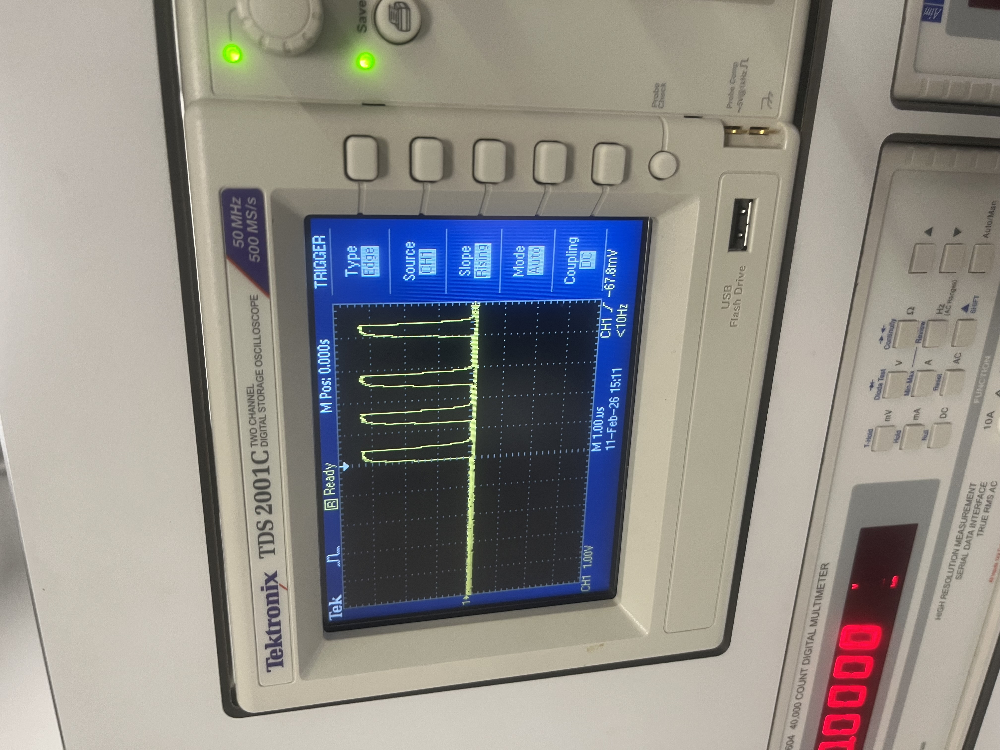

# Specialist Embedded Audio and Tilt-Controlled Warning System

STM32 embedded system combining tilt detection, WS2812 LED control, DMA-based ADC sampling, timer interrupts, and digital I²S audio output.


---

## Overview

This project expands the original Project 1 tilt-controlled LED ring system into a more advanced specialist embedded system by integrating digital audio generation, DMA transfers, timer interrupts, and I²S audio communication using the STM32L432 microcontroller.

The final system combines:

- tilt detection using a BMI160 accelerometer
- WS2812B LED ring control
- DMA-based ADC sampling
- timer interrupt scheduling
- UART debugging
- SAI/I²S digital audio output
- MAX98357A speaker amplifier integration
- tilt-triggered audio warning tones

The project demonstrates integration of multiple embedded peripherals operating simultaneously while maintaining stable real-time behaviour.

---

## Objectives

The objectives of this project were:

- Extend the original Project 1 embedded system
- Configure SAI/I²S digital audio output
- Interface with a MAX98357A audio amplifier
- Implement DMA-based audio streaming
- Implement DMA-based ADC sampling
- Implement timer interrupt-driven events
- Generate waveform lookup tables using MATLAB
- Integrate audio response with tilt detection
- Maintain stable LED ring behaviour alongside audio playback
- Apply structured embedded testing and debugging methods
- Use GitHub for version control and documentation

---

## Final System Features

### Key Features

- Tilt-controlled WS2812 LED ring pointer
- 3-LED directional pointer
- Low-pass filtered accelerometer readings
- Push button colour selection
- Potentiometer brightness and save-position control
- UART debugging output
- Timer interrupt system
- DMA-based ADC sampling
- SAI/I²S digital audio output
- MAX98357A speaker amplifier integration
- Tilt-activated 300 Hz warning tone

---

## Hardware Used

- STM32L432 Nucleo board
- BMI160 accelerometer
- WS2812B 16-LED ring
- MAX98357A I²S mono amplifier
- 8 Ω speaker
- Potentiometer
- Push button
- Breadboard and jumper wires
- Oscilloscope
- USB serial monitor

---

## Peripheral Usage

| Peripheral | Purpose |
|---|---|
| GPIO | LED control, button input, debug heartbeat |
| I2C | BMI160 accelerometer communication |
| ADC | Potentiometer analogue input |
| DMA | Continuous ADC and audio transfers |
| SAI / I²S | Digital audio transmission |
| TIM2 | Interrupt timing and PWM |
| UART | Serial debugging output |
| DWT cycle counter | Precise WS2812 timing |

---

## System Description

The system operates as several integrated embedded subsystems running simultaneously.

### Tilt Detection System

The BMI160 accelerometer provides X, Y and Z acceleration data over I²C. The system filters the acceleration values and determines the tilt direction.

### LED Ring Display System

The WS2812B LED ring displays the current tilt direction using a 3-LED pointer. A dead zone prevents jitter when the board is flat.

### Audio System

The MAX98357A amplifier receives digital audio data from the STM32 using the I²S protocol.

Different stages of the project used:

- DMA audio streaming through SAI
- waveform lookup tables generated in MATLAB
- software-generated warning tones

### ADC Input System

A potentiometer connected to ADC1 provides analogue user input. DMA continuously transfers ADC samples into memory while timer interrupts periodically average the values.

### Interrupt and Timing System

TIM2 generates periodic interrupts while DMA handles continuous peripheral transfers independently of the CPU.

---

## Project Development Procedure (LO5)

The system was developed incrementally, with each subsystem tested independently before full integration.

---

## Task 1 – Re-establishing the Project 1 System

### Goal

Restore the fully working tilt-controlled LED ring system from Project 1.

### Functionality Restored

- accelerometer communication
- WS2812 LED ring control
- tilt direction mapping
- colour selection
- PWM brightness control
- saved-position mode
- UART debugging

### Example Code

```c
X_g = read_bmi160_axis(0x12);
Y_g = read_bmi160_axis(0x14);

X_filt = (3 * X_filt + X_g) / 4;
Y_filt = (3 * Y_filt + Y_g) / 4;
```

### Result

The original Project 1 system was successfully restored with stable operation and smooth tilt-controlled LED movement.

---

## Task 2 – Configuring the I²S Audio System

### Goal

Configure the STM32L432 SAI peripheral and MAX98357A amplifier for digital audio output.

### Wiring Added

| STM32 Pin | MAX98357A |
|---|---|
| PA8 | BCLK |
| PA9 | LRC |
| PA10 | DIN |
| 3V3 | VIN |
| GND | GND |

Speaker connections:

- OUTP → speaker positive
- OUTN → speaker negative

### Example Code

```c
DMA2_Channel6->CMAR = (uint32_t)audio_data;
DMA2_Channel6->CPAR = (uint32_t)&SAI1_Block_A->DR;
DMA2_Channel6->CNDTR = AUDIO_LENGTH;
```

### Result

The STM32 successfully transmitted digital audio signals to the MAX98357A amplifier using the I²S protocol.

---

## Task 3 – MATLAB Audio Waveform Generation

### Goal

Generate digital audio waveform lookup tables for embedded playback.

### MATLAB Implementation

MATLAB was used to generate sine wave sample arrays.

### Example MATLAB Code

```matlab
fs = 16000;
duration = 0.01;

t = 0:1/fs:duration;

x = 32767 * sin(2*pi*300*t);

x = int16(x);
```

The generated waveform values were exported into `audio_data.h`.

### Result

A valid 300 Hz waveform lookup table was generated and successfully used for embedded audio playback.

---

## Task 4 – Timer-Based Audio Control

### Goal

Introduce interrupt-driven timing into the embedded system using TIM2.

### Implementation

TIM2 was configured to generate periodic interrupts instead of relying entirely on software delays.

The interrupt routine was used for:

- heartbeat GPIO toggling
- ADC averaging timing
- periodic system updates

### Example Code

```c
TIM2->PSC = 8000 - 1;
TIM2->ARR = 1000 - 1;

TIM2->DIER |= (1 << 0);

NVIC_EnableIRQ(TIM2_IRQn);

TIM2->CR1 |= (1 << 0);
```

### Result

Interrupt-driven timing operated correctly while DMA audio playback continued independently in the background. The heartbeat GPIO verified correct interrupt execution frequency.

---

## Task 5 – DMA-Based ADC Sampling

### Goal

Implement continuous ADC sampling using DMA.

### Implementation

ADC1 was configured in continuous conversion mode with DMA circular buffering enabled.

DMA automatically transferred ADC samples into memory without CPU intervention.

### Example Code

```c
DMA1_Channel1->CCR =
    (1 << 10) |
    (1 << 8)  |
    (1 << 7)  |
    (1 << 5);

ADC1->CFGR |= ADC_CFGR_CONT;
ADC1->CFGR |= ADC_CFGR_DMAEN;
ADC1->CFGR |= ADC_CFGR_DMACFG;
```

### Result

ADC values updated continuously while:

- audio playback continued
- interrupts operated normally
- LED ring updates remained stable

The CPU no longer needed to manually poll the ADC.

---

## Task 6 – Audio Response Based on Tilt Direction

### Goal

Generate an audible warning tone when excessive tilt is detected.

### Additional Wiring

No additional wiring changes were required beyond the I²S audio subsystem added previously.

### Implementation

The existing Project 1 tilt detection system was expanded so that a 300 Hz warning tone played whenever excessive tilt was detected.

The tone activated during:

- excessive forward tilt
- excessive backward tilt
- excessive left tilt
- excessive right tilt

### Example Code

```c
if ((X_filt > 700) || (X_filt < -700) ||
    (Y_filt > 700) || (Y_filt < -700))
{
    play_tone = 1;
}
else
{
    play_tone = 0;
}
```

### Result

The warning tone successfully activated during unsafe tilt conditions while the LED ring continued operating normally.

---

## Task 7 – Final System Integration

### Goal

Integrate all embedded subsystems into one stable real-time embedded system.

### Integrated Features

- I²C accelerometer communication
- WS2812 LED ring control
- DMA ADC sampling
- timer interrupts
- UART debugging
- I²S audio output
- tilt-triggered audio warnings

### Final Integrated Behaviour

The final system simultaneously performed:

- real-time tilt detection
- LED direction mapping
- audio playback
- ADC sampling
- interrupt scheduling
- UART debugging

without major timing conflicts.

### Result

All embedded subsystems operated together successfully with stable and responsive behaviour.

---

## Software Design

The software was structured into modular functions for:

- sensor reading
- audio output
- DMA configuration
- timer interrupts
- ADC sampling
- LED ring control
- tilt processing
- UART debugging

A low-level register-based programming approach was used throughout the project.

---

## Testing and Results (LO4)

Each subsystem was tested independently before full integration.

### Test 1 – I²S Audio Verification

**Method:**  
Oscilloscope measurements and speaker output verification.

**Result:**  
Valid digital audio signals were transmitted successfully.

---

### Test 2 – DMA Audio Playback

**Method:**  
Continuous waveform playback testing.

**Result:**  
DMA transferred audio samples correctly without CPU polling.

---

### Test 3 – Timer Interrupt Operation

**Method:**  
Heartbeat GPIO toggled inside TIM2 interrupt routine.

**Result:**  
Interrupts occurred at the expected frequency.

---

### Test 4 – DMA ADC Sampling

**Method:**  
ADC values printed continuously over UART.

**Result:**  
ADC values updated correctly while the CPU remained mostly idle.

---

### Test 5 – Tilt-Based Audio Trigger

**Method:**  
Board tilted manually in multiple directions.

**Result:**  
300 Hz warning tone activated correctly during excessive tilt conditions.

---

### Test 6 – Full System Integration

**Method:**  
All subsystems operated simultaneously during runtime testing.

**Result:**  
Stable operation achieved with simultaneous LED, ADC, UART and audio activity.

---

## Debugging Methods

A combination of software and hardware debugging techniques was used.

### Software Debugging

- UART output used to print sensor and ADC values
- DMA buffer contents inspected in debugger
- incremental subsystem testing used throughout development

### Ad-hoc Debugging

- heartbeat GPIO toggling used for interrupt verification
- LEDs used to visualise system states
- individual subsystem isolation tests performed

### Hardware Debugging

- oscilloscope used to inspect I²S clock and data signals
- WS2812 waveform timing verified
- speaker output used to confirm audio functionality

---

## Circuit Design

A schematic was created using KiCad.

Connections include:

- BMI160 connected using I²C
- WS2812 LED ring connected through GPIO data line
- MAX98357A connected using I²S
- speaker connected to amplifier outputs
- potentiometer connected to ADC input
- push button connected to GPIO input
- shared common ground between all subsystems

[View Full Schematic PDF](Circuit_schematic.pdf)

---

## System Images

### Working Project


### Circuit Schematic


### Oscilloscope Debugging



---

## Development Log

A more detailed record of testing, debugging and development is available here:

[View Full Development Log](Development_Log.docx)

---

## Results Summary

The final system successfully demonstrated:

- real-time tilt detection
- stable WS2812 LED control
- DMA-based ADC sampling
- timer interrupt scheduling
- digital audio generation
- I²S communication
- simultaneous subsystem integration

The completed project met the original objectives and demonstrated successful integration of multiple embedded peripherals into a stable real-time embedded system.

---

## Ethical Considerations

Embedded systems are widely used in safety-critical and industrial environments. Reliable system behaviour, proper testing, and robust debugging are important to ensure safe operation.

This project demonstrated:

- structured subsystem testing
- controlled hardware interfacing
- reliable real-time behaviour
- safe low-voltage embedded operation

The use of incremental testing and debugging reduced the likelihood of hardware damage and incorrect system behaviour.

---

## GitHub and Version Control (LO6 and LO7)

GitHub was used throughout the project for:

- version control
- software backup
- development tracking
- documentation
- project organisation

The repository contains:

- source code
- circuit schematics
- development logs
- test documentation
- images
- README documentation

---

## Video Demonstration

[Watch the demo video on YouTube](https://youtu.be/A2sVNCb3_ys)
